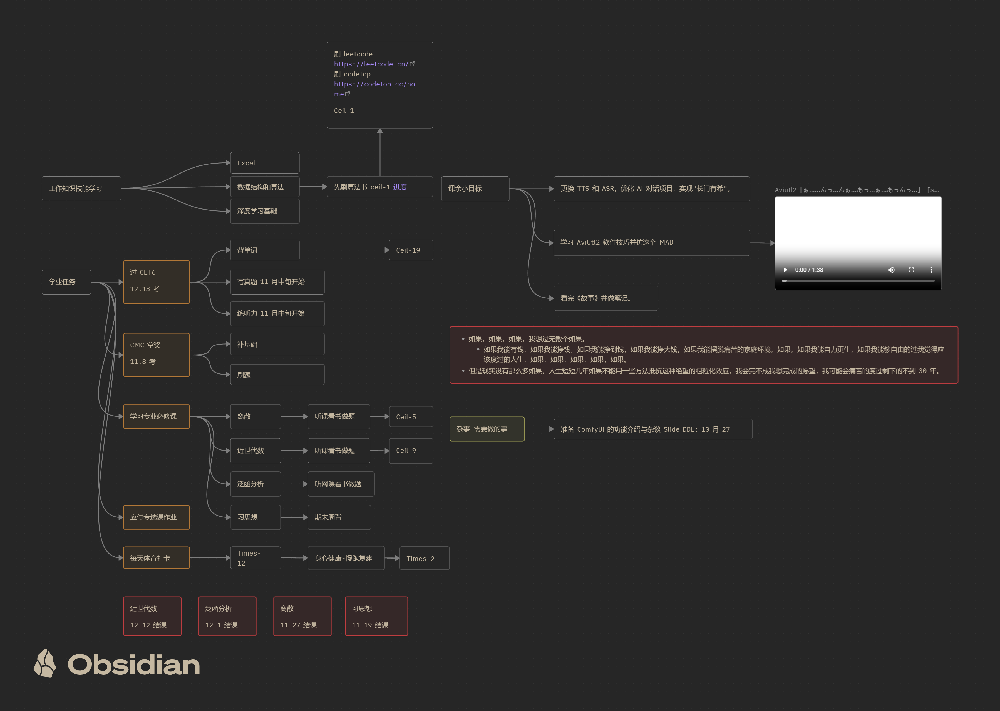
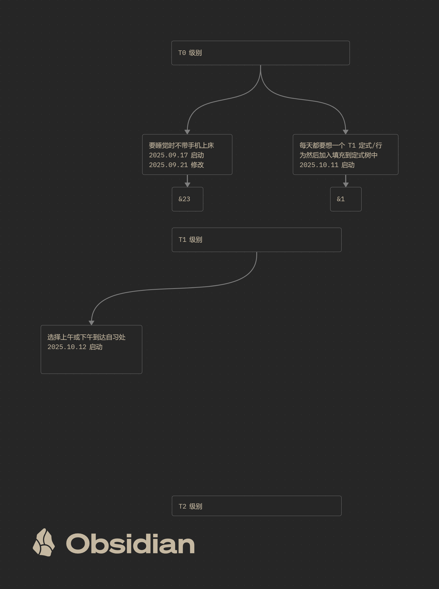

# RECORD

## CTDP

根据 [[2025-秋季学期-大三上.canvas|2025-秋季学期-大三上]] 内容进行分析

- 背单词：
	- +11——19
- 离散
	- +4——9
- 体育打卡
	- +12——12
- 慢跑
	- +2——2

泛函失败
ComfyuiSlider 失败

## RSIP

根据 [[定式树.canvas|定式树]] 内容进行分析

基本稳定。
有所增加

## Next Week CTDP

泛函 +3
抽代 +3
CMC 备考+3

## Problem

<iframe width="100%" height="468" src="//player.bilibili.com/player.html?bvid=BV1eM411Q7jz" scrolling="no" border="0" frameborder="no" framespacing="0" allowfullscreen="true"> </iframe>

又回看了下这个视频，发现自己确实不符合这个时间分配，一天下来其实很多时间是浪费掉的，浪费在宿舍里。

所以我需要根据"宿舍内与宿舍外"这个事想一个行为/习惯，那应该就是必须选择上午或下午背书包前往自习处。

Ok，已添加。然后就是国庆确实摆烂了周总结，而且基本没看数学，没做题，或许我应该剃头发了。

然后呢昨天看那个作者分享的国策树才意识到自己太过于追求完美了，其实就是逃避，就是拖延，这个定式树才是前期需要加速建立的东西，这样才能让自己有足够的自由意志去完成目标。

然后，我的那个强有力的"理由"仍然没有想出来，感觉就是“什么有意思就做什么的状态”

所以最近又开始研究怎么炼 lora，em，虽然做出了一些成功，发现了一些新东西，感觉也就这样，对我这学期的学业没有任何帮助，我这学期还有 cet6 然后莫名其妙报了 cmc，然后只有不到一个月的时间，我的数分高代解几基础也忘的差不多了，并且淑芬基础很薄弱，高代也不稳，很难说能拿到什么成绩，但是参都参加了，不拿个铜也没什么意思，或许我的数学生涯就这一次能拿个奖的机会，就这一次,,,, 我应该想办法努力

明天就开始找资源想办法备考吧。

嗯。

大概就这样，说实话压力大，但是不去做，那问题就更大。