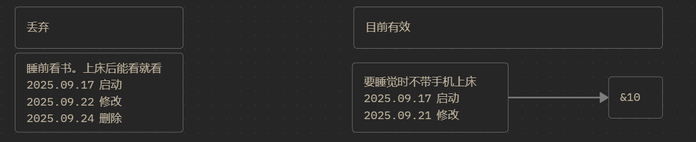

# RECORD

## CTDP

根据 [[2025-秋季学期-大三上.canvas|2025-秋季学期-大三上]] 内容进行分析
- 背单词
	- &+5——&8
- 近世代数
	- &+2——&5
- 离散
	- &+5——&5
- 

## RSIP

根据 [[定式树.canvas|定式树]] 内容进行分析

坚持至今，距离第一个习惯周期还有 11 天，也就是说等到下下周的时候我的作息基本就正常了。

但是呢，我的其他稳态如何迭代迁移呢。

## Next Week CTDP

由于下周三就开始放假放到 10 月 8 号，或许要专门指定计划。但，还是保持不变吧，也就是 10 月 5 号的时候我仍然要进行总结回顾的。

- 泛函
	- Ceil +>5
- 近世代数
	- Ceil +>5
- 背英语
	- Ceil +>5
- Comfyui PPT
	- Ceil +>3
还是统一改成 ceil 比较好。
嗯

## Problem

### Auxilary Chain 到底怎么办？

目前呢感觉有点模糊，但是有相对明晰的定义了，auxilary chain 可能还是不纳入记录了，他是比 CTDP 更 tech 的东西，所以，嗯，没什么好说的，就是一种启动技术。

OK，分为以下两种

Hour 型
	用于 1 小时内的倒计时，启动 Ceil。
Day 型
	用于 1 天的倒计时，用于启动 Hour 型 Auxilary Chain。

这个就是日计划的一些事情了。

### 晚上不要 Vibe coding ！

额，大白天，下午这种还好，但是如果一直拖到晚上快写 record 了背单词了还几把搁那 vibe coding 真的会出事的。

这个事也不那么常见，记个教训就好。

### 破罐破摔心理

比如周二上午，周三下午这些空闲时间，还有周末两天，我就喜欢跑 AI 图或者刷垃圾小视频。麻痹的。

目前不懂怎么解决这事，但或许可以提前用 auxilary chain 来控制，嗯。可以搞一下。

但是一天太累了也不好。
我现在写了两个多小时离散回来感觉就很累。
我操尼德。

所以精力恢复，精力管理还是需要的。
毕竟这事本质上就是精力不足导致的。

### 回看 record

感觉也还行。每天都有记录，额向外展示说实话也没有什么必要，大概就这样。

