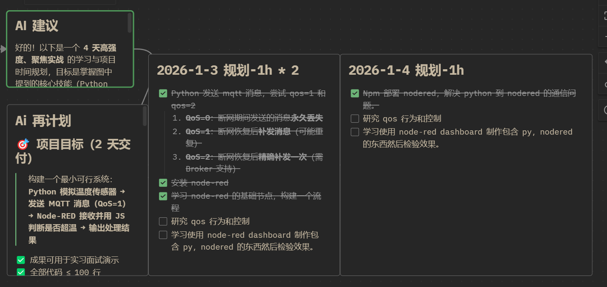
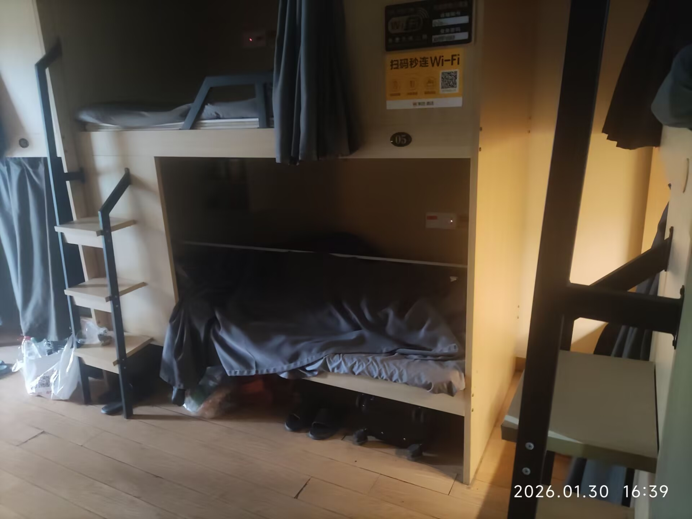
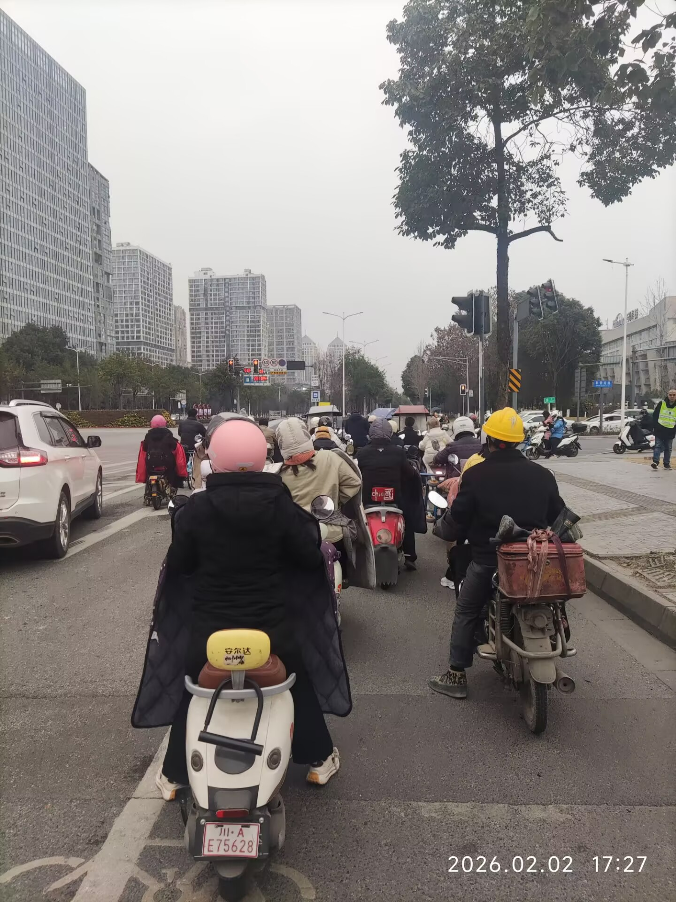
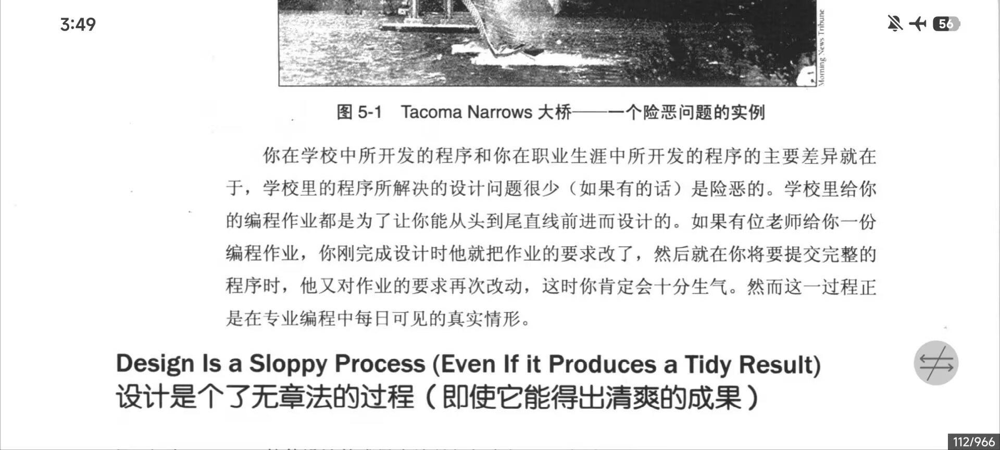

# 艰难的第一次实习

## 收到通知
从何讲起呢。大概从去年年末，我偶然得到一次内推机会去到成都一个制造业公司实习。做的是数据采集和清洗。嗯，听起来并不难。于是我根据学长的建议，开始补齐一些需要的知识，比如node-red——一个常用的工业物联网自动化低代码平台。

 
在学校的日子里，与舍友没什么好关系，彼此之间冷漠相对，仅仅维持一些必要的交流。嗯。随便扯扯。

 
然后我在考完试之后就每天都在看相关内容，效率很低，我跟着AI的建议去做，或许有些作用，但实际上，对我在实习中的工作毫无帮助，我对数据清洗毫无认知，以及，遇到的情况和实际的工作内容更是完全不知道如何应对的。

 

## 1月——煎熬的青旅

在每晚30块的青旅里，我只能呆在床上，吃着外卖，艰难的使用电脑，除此之外就没什么能做的。

 
简历只是草草的根据去年的经历随便写的，然后有好心学长wyh(猫娘)帮我修改了下，看着确实像那么回事了，然后，在青旅期间，我还得找一个地方去线上面试，毕竟在这个狭小空间里，也做不了什么。

 
于是我就找了个网吧，去勉强开了个包间，然后不顺利的面试。面试的过程并不好，我的语言组织能力很差。很多事我都没能很好的说明白以及做出好的回答。但据内推学长说，我这只是走个过场，毕竟缺人干活，所以很快就办好手续了，大概。

 
没什么说的了，在青旅里基本上没做什么事，没看什么东西，只有玩，并且不痛快。哦对了，由于青旅毕竟不是久留之地，所以我还是找了个合租房去住。大概是2月份入住，房租还算便宜，期间我反复跟地铺西克聊资金周转问题。

## 2月——正式开始上班

大概是2月2号开始上班，但第一周的时候其实还是在熟悉环境。毕竟什么都不懂。但实际上我花了3周才勉强知道工作任务是什么。

 

 
每天就是早上起来，刷牙，然后骑单车20分钟出勤去公司。然后开始一天的无所事事。无所事事的时间有挺多的，因为我确实不了解工作内容。

 
数据采集本来是在node-red上进行，但是一个外国人开发了新的框架，可以通过高代码转低代码的方式生成flow，而不是手动搭flow。他认为手动搭flow是非常stupid。问题就在这里。我一开始根本不知道怎么去做。

 
很多概念其实慢慢接受之后就能理解，但缺失的内容实在太多了，我对计算机如何运行其实毫无头绪，只知道有一些编程语言，可以通过各种语法，工具包，实现一些或许复杂的事情，但除此之外我毫无头绪。我不知道数据传输中的事件捕获机制，缓存机制，队列机制，所以我花了很久都没能理解那个框架到底是怎么写高代码的。高代码部分包含了数据采集的业务逻辑——简言之就是对需要的数据进行采集然后识别和转换为一个‘产品’，一个数据产品包含实际生产过程中各种检测数据的结果，嗯，还是很复杂。我没能理解。

 
那么我是怎么搞砸的呢？我大量地使用AI，去生成各种狗屎内容，然后把他交给那个外国人来审查，然后让他感到莫名其妙以及无可奈何，给我说明很多细节，然后反复说：你可以用AI，但更重要的是你的逻辑。之后就是Use less AI，YOU need to write code。

 
我对AI的依赖太多了，以及我根本无法知道什么才是正确的开发模式，以及从2024年开始一周速通python后我的编程学习就开始严重依赖AI，这毕竟是不好的。严重到我根本不会去读我感兴趣的任何开源项目代码，而是直接把他丢给AI，然后说几句修改意见就坐享其成了。这也体现了我的本性。我是一个懒惰至极的人，并且十分迷信‘状态’，‘欲望的动力’等。嗯。随便扯扯。

 
简而言之，2月没能做成什么事，也没能理解什么事。

## 3月上旬与中旬——好像开始理解一点点内容。

其实年后我才知道我得使用那个框架去写东西，然后才开始频繁的commit shit on stupid branch。最开始的branch里我在纯粹的vibecoding，之后的新branch我才开始假模假样的研究框架，去看标准实践的代码，的AI写的文档。是的，仿佛代码对我而言就是脏东西，我得让AI给我过滤一遍，然后品鉴AI写的美丽的文档，实际上我依然不了解内容。

 
是的，其实这事情不难，只是明确一些必要的信息，明确要处理的流程就好。但我偏偏没有老实的去做。最近看《代码大全》

这就很清楚描述了我的困境。

 
中旬里我就得先回学校了，毕竟我还是惧怕学校不给我毕业证。由于这只是实习，所以解除实习也好商量。但我还是尽可能有点责任心，之后花半个月时间整理一下实习结果——那些狗屎文档。之后就该回到学校——舒适区里思考未来了。

